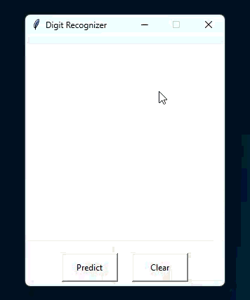

# MNIST Digit Recognizer

A PyTorch-based convolutional neural network that classifies handwritten digits (0–9) using the MNIST dataset.  
The project includes a Tkinter-based GUI where users can draw digits and get real-time predictions.

---

## Demo



---

## Features

- CNN trained on MNIST dataset
- Interactive drawing interface (Tkinter)
- Real-time digit prediction
- Image preprocessing pipeline (PIL + torchvision)
- Model inference using PyTorch

---

## Model Architecture

The model is a convolutional neural network consisting of:

- 2 convolutional layers (feature extraction)
- 2 max pooling layers (downsampling)
- 3 fully connected layers (classification head)

Input: 28×28 grayscale image  
Output: probability distribution over 10 digit classes (0–9)

---

## Training Details

- Dataset: MNIST
- Batch size: 65
- Epochs: 5
- Learning rate: 0.01
- Loss function: CrossEntropyLoss
- Optimizer: SGD (optional momentum)

Final test accuracy: ~98%

---

## Installation

### 1. Clone repository
```bash
git clone https://github.com/kevinpettersson/mnist-digit-recognizer.git
cd mnist-digit-recognizer
```

### 2. Create a virtual environment (recommended)

```bash
python -m venv .venv
```
### 3. Activate the virtual environment
```bash
# Windows (PowerShell)
.venv\Scripts\Activate.ps1

# Linux / macOS
source .venv/bin/activate
```
### 4. Install dependencies
```bash
pip install -r requirements.txt
```

### 5. Run the application
```bash
python src/main.py
```

